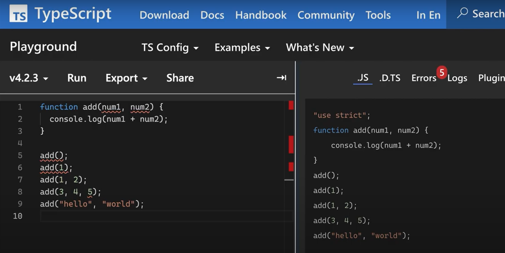

## Typescript
- 브라우저는 typescript를 인식 못함
  - typescript로 짠 코드를 javascript로 변환해야 함
- [TypeScript Playground](https://www.typescriptlang.org/play)
  - TypeScript를 코딩한 후, 변경된 Javascript를 바로 확인 가능
- ``node.js``를 이용하는 방법
  - typescript 패키지를 설치
  - tsc를 이용하여 typescript를 javascript로 변환
  - javascript 실행
```bash
$npm install -g typescript
$tsc index.ts
gusam@DESKTOP-RF6D56E MINGW64 /d/Workspace/typescript-practice (main)
$node index.js
[ 'z', 1, 2 ]
```

### Typescript를 사용하는 이유
- 아래와 같이, javascript에서는 인자를 전달하지 않아도 에러가 발생하지 않음
  - ``NaN = undefined + undefined``
  - ``NaN = number + undefined``
```javascript
function add(num1, num2) {
    console.log(num1 + num2);
}

add();
add(1);
add(1, 2);
add(3, 4, 5);
add('hello', ' world');
```
```bash
$node index.js 
NaN
NaN
3
7
hello world
```
- Javascript는 동적언어
  - 런타임에 타입 결정 및 오류 발견 가능
```javascript
function showItems(arr) {
    arr.forEach(item => {
        console.log(item);
    });
}

showItems([1, 2, 3]);
showItems(1, 2, 3);
```
```bash
$node index.js 
1
2
3
D:\Workspace\typescript-practice\index.js:2
    arr.forEach(item => {
        ^

TypeError: arr.forEach is not a function
    at showItems (D:\Workspace\typescript-practice\index.js:2:9)
    at Object.<anonymous> (D:\Workspace\typescript-practice\index.js:8:1)
    at Module._compile (node:internal/modules/cjs/loader:1101:14)
    at Object.Module._extensions..js (node:internal/modules/cjs/loader:1153:10)
    at Module.load (node:internal/modules/cjs/loader:981:32)
    at Function.Module._load (node:internal/modules/cjs/loader:822:12)
    at Function.executeUserEntryPoint [as runMain] (node:internal/modules/run_main:81:12)
    at node:internal/main/run_main_module:17:47
```
- Java, TypeScript는 정적 언어
  - 컴파일 타임에 타입 결정 및 오류 발견     
- TypeScript에서 Javascript 예제를 적용하면, 아래 이미지처럼 타입을 체크해 줌


- Typescript를 적용하면, 아래와 같이 수정해야 함
```javascript
function add(num1:number, num2:number) {
    console.log(num1 + num2);
}

//add();
//add(1);
add(1, 2);
//add(3, 4, 5);
//add(1, ' world');
```
```javascript
function showItems(arr:number[]) {
    arr.forEach(item => {
        console.log(item);
    });
}

showItems([1, 2, 3]);
//showItems(1, 2, 3);
```
### Typescript의 기본 타입
#### 기본 타입과 배열 그리고, Tuple
- Tuple: 배열의 요소마다 타입이 다른 경우, 그 타입을 명시

```javascript
// Basic types: string, number, boolean
let car:string = 'bmw';
let age:number = 30;
let isAdult:boolean = true;

// Array
let a1:number[] = [1, 2, 3];
let a2:Array<number> = [1, 2, 3];
let week1:string[] = ['mon', 'tue', 'wed'];
let week2:Array<string> = ['mon', 'tue', 'wed'];

// Tuple
let b:[string, number, number];
b = ['z', 1, 2];
b[0].toLowerCase();
//b[1].toLowerCase();
console.log(b);
```
#### 함수의 반환 타입
- 반환하지 않는 경우
```javascript
function sayHello():void {
    console.log('hello');
}

sayHello();
//let a:string = sayHello();
```
- 에러를 Throw하거나, 무한 루프인 경우
```javascript
function showError():never {
    throw new Error();
}

function infLoop():never {
    while (true) {
        // do something...
    }
}
```
#### enum type
##### 숫자를 사용한 enum type
- ``index.ts``
```javascript
enum Os {
    Windows,
    Ios = 4,
    Android
}

let myOs:Os = Os.Windows;

console.log(Os[4]);
console.log(Os["Ios"]);
```
- ``index.ts``를 tsc로 수행한 결과
```javascript
"use strict";
var Os;
(function (Os) {
    Os[Os["Windows"] = 0] = "Windows";
    Os[Os["Ios"] = 4] = "Ios";
    Os[Os["Android"] = 5] = "Android";
})(Os || (Os = {}));
let myOs = Os.Windows;
console.log(Os[4]);
console.log(Os["Ios"]);
```
- 수행 결과
```bash
$tsc index.ts
$node index.js
Ios
4
```
##### 문자열을 사용한 enum type
- ``index.ts``
```javascript
enum Os {
    Windows = 'win',
    Ios = 'ios',
    Android = 'and'
}

let myOs:Os = Os.Windows;
console.log(myOs);
```
- ``index.ts``를 tsc로 수행한 결과
```javascript
var Os;
(function (Os) {
    Os["Windows"] = "win";
    Os["Ios"] = "ios";
    Os["Android"] = "and";
})(Os || (Os = {}));
var myOs = Os.Windows;
console.log(myOs);
```
- 수행 결과
```bash
$tsc index.ts
$node index.js
win
```
##### null, undefined type
- ``index.ts``
```javascript
let a:null = null;
let b:undefined = undefined;
```
- ``index.ts``를 tsc로 수행한 결과
```javascript
var a = null;
var b = undefined;
```
### 인터페이스(Interface)
- 아래와 같은 코드를 typescript로 작성하면 에러가 발생
  - ``user.name, user.age``에 대한 Type이 지정되지 않았기 때문
```typescript
let user:object;

user = {
    name: 'xx',
    age: 30
}

console.log(user.name, user.age);
```
- 해당 문제를 해결하기 위해 interface를 사용
```typescript
interface User {
    name:string;
    age:number;
}
let user:User = {
    name: 'xx',
    age: 30
}

console.log(user.name, user.age);
```
- 선택적인 속성을 지정하는 방법
  - ``?``를 속성명 뒤에 붙임
```typescript
interface User {
    name:string;
    age:number;
    gender?:string;
}

let user:User = {
    name: 'xx',
    age: 30
}

console.log(user.name, user.age);

user.gender = 'male';
console.log(user.name, user.age, user.gender);
```
- 읽기 전용(ReadOnly)를 만드는 법
  - 최초에 생성할 때만 할당이 가능함
```typescript
interface User {
    name: string;
    age: number;
    gender?: string;
    readonly birthYear: number;
}

let user:User = {
    name: 'xx',
    age: 30,
    birthYear: 2000
}

user.age = 10;
user.gender = 'male';
//user.birthYear = 1998;

console.log(user.name, user.age, user.gender, user.birthYear);
```
- User에 1학년부터 4학년까지 성적을 입력하게 하려면?
  - interface의 선언이 복잡해짐
```typescript
interface User {
    name: string;
    age: number;
    gender?: string;
    readonly birthYear: number;
    1? : string;
    2? : string;
    3? : string;
    4? : string;
}

let user:User = {
    name: 'xx',
    age: 30,
    birthYear: 2000,
    1: 'A'
}

user.age = 10;
user.gender = 'male';

console.log(user.name, user.age, user.gender, user.birthYear);
```
- 문자열 인덱스 서명을 사용하는 방법으로 개선
```typescript
interface User {
    name: string;
    age: number;
    gender?: string;
    readonly birthYear: number;
    [grade:number]: string;
}

let user:User = {
    name: 'xx',
    age: 30,
    birthYear: 2000,
    1: 'A',
    2: 'B'
}

user.age = 10;
user.gender = 'male';

console.log(user.name, user.age, user.gender, user.birthYear);
console.log(user["1"], user["2"]);
```
- 문자열 리터럴 타입
  - 위의 예제에서 성적의 값이 문자열로 지정되어서 범위가 너무 넓음
  - 특정 문자열만 가능하도록 범위를 제한
```typescript
type Score = 'A' | 'B' | 'C' | 'F';

interface User {
    name: string;
    age: number;
    gender?: string;
    readonly birthYear: number;
    [grade:number]: Score;
}

let user:User = {
    name: 'xx',
    age: 30,
    birthYear: 2000,
    1: 'A',
    2: 'B'
    //3: 'D'
}

user.age = 10;
user.gender = 'male';

console.log(user.name, user.age, user.gender, user.birthYear);
console.log(user["1"], user["2"]);
```
- 인터페이스로 함수를 지정하는 방법
  - 인자의 타입과 반환 타입을 지정 가능
```typescript
interface Add {
    (num1:number, num2:number):number;
}

const add:Add = function(x, y) {
    return x + y;
}

console.log(add(10, 20));

interface IsAdult {
    (age:number):boolean   
}

// 화살표 함수 사용 가능
const isAdult:IsAdult = age => age > 19;
console.log(isAdult(40));
```
- 인터페이스로 클래스를 선언하는 방법
  - 속성과 메소드를 지정  
```typescript
interface Car {
    color:string;
    wheels:number;
    start():void;
}

class Bmw implements Car {
    color;
    wheels = 4;

    constructor(color:string) {
        this.color = color;
    }

    start() {
        console.log('go.....');
    }
}

const myCar = new Bmw('green');
console.log(myCar);
myCar.start();
```
```javascript
// 아래와 같이 javascript로 변환됨
"use strict";
class Bmw {
    constructor(color) {
        this.wheels = 4;
        this.color = color;
    }
    start() {
        console.log('go.....');
    }
}
const myCar = new Bmw('green');
console.log(myCar);
myCar.start();
```
```bash
# 수행결과
Bmw: {
  "wheels": 4,
  "color": "green"
} 
"go....."
```
- 인터페이스를 확장하는 방법
  - ``extends`` 키워드를 사용
```typescript
interface Car {
    color:string;
    wheels:number;
    start():void;
}

interface Benz extends Car {
    door:number;
    stop():void;
}

const myBenz:Benz = {
    door:5,
    stop() {
        console.log('stopped.....');
    },
    color:'blue',
    wheels:4,
    start() {
        console.log('start.....');
    }
}
console.log(myBenz);
myBenz.stop();
```
- 여러개의 인터페이스를 확장하는 방법
  - ``extends`` 키워드를 사용
```typescript
interface Car {
    color:string;
    wheels:number;
    start():void;
}

interface Toy {
    name:string;
}

interface ToyCar extends Car, Toy {
    price:number;
}

const myToyCar:ToyCar = {
    name:'myToyCar',
    color:'red',
    wheels:10,
    price:10000,
    start() {
        console.log('myToyCar is starting');
    }
}

console.log(myToyCar);
myToyCar.start();
```
```bash
{
  "name": "myToyCar",
  "color": "red",
  "wheels": 10,
  "price": 10000
} 
"myToyCar is starting"
```
### 함수(function)
- 매개변수와 리턴타입을 명시한 함수 선언을 함
```typescript
function add(num1:number, num2:number):void {
    console.log(num1 + num2);
}

function isAdult(age:number):boolean {
    return age >= 20;
}

add(1, 2);
console.log(isAdult(12));
```
- 함수의 인자도 Optional하게 지정 가능
  - `Hello, ${name || "world"}`의 의미
    - name이 null, undefined 또는 ""인 경우, "world"를 기본값으로 사용
```typescript
function hello(name?:string) {
    return `Hello, ${name || "world"}`;
}

console.log(hello("KyuSahm"));
console.log(hello());
```
```bash
# 실행 결과
"Hello, KyuSahm" 
"Hello, world"
```
- 함수의 인자의 기본값 지정 가능
```typescript
function hello(name = 'world') {
    return `Hello, ${name}`;
}

console.log(hello("KyuSahm"));
console.log(hello());
```
```bash
# 실행 결과
"Hello, KyuSahm" 
"Hello, world" 
```
- 선택적인 인자의 사용 예: 선택적 인자들은 맨 뒤에 위치해야 함
```typescript
function hello(name:string, age?:number):string {
    if (age !== undefined) {
        return `Hello, ${name}. You are ${age}`;
    } else {
        return `Hello, ${name}`;
    }
}

console.log(hello("KyuSahm"));
console.log(hello("Sam", 30));
```
```bash
# 실행 결과
"Hello, KyuSahm" 
"Hello, Sam. You are 30" 
```
- 앞쪽의 인자를 선택적으로 사용하고 싶으면 아래와 같은 형태로는 가능
```typescript
function hello(age:number|undefined, name:string):string {
    if (age !== undefined) {
        return `Hello, ${name}. You are ${age}`;
    } else {
        return `Hello, ${name}`;
    }
}

console.log(hello(undefined, "KyuSahm"));
console.log(hello(30, "Sam"));
```
```bash
# 실행 결과
"Hello, KyuSahm" 
"Hello, Sam. You are 30" 
```
- 나머지 매개 변수의 타입 작성법
  - 매개 변수의 타입을 특정 타입의 배열로 지정해야 함
```javascript
function add(...nums:number[]) {
    return nums.reduce((result, num) => result + num, 0);
}

console.log(add(1, 2, 3));
console.log(add(1, 2, 3, 4, 5, 6, 7, 8, 9, 10));
```
```bash
# 실행 결과
6 
55 
```
- ``this``와 관련된 내용
  - bind함수를 사용하면 this는 내가 정한 object로 고정할 수 있다
  - typescript에서는 첫번째 함수의 인자로 this object의 object type을 지정 가능
```typescript
interface User {
    name:string;
}

const Sam:User = {name:'Sam'}

function showName(this:User, age:number, gender: 'm'|'f') {
    console.log(this.name, age, gender);
}

// bind 함수의 정의:
// For a given function, create a bound function that has the same body
// as the original function. 
// The this object of bound function is associated with the specified object,
// and has the specified initial parameters

// this object is bound to Sam object
const a = showName.bind(Sam);
a(30, 'm');
```
```bash
# 실행 결과
"Sam",  30,  "m"
```
- 매개 변수 타입과 리턴 타입이 여러 개일 경우에 overloading 시키는 방법
  - 함수 선언 부 위에 별도로 명시해 주면 됨
```javascript
interface User {
    name:string;
    age:number;
}

// overloading
function join(name:string, age: number): User;
function join(name:string, age: string): string;
function join(name:string, age: number | string): User | string {
    if (typeof age === "number") {
        return {name, age};
    } else {
        return "Please insert age with number format";
    }
}

const sam:User = join("Sam", 30);
const jane:string = join("Sam", "30");

console.log(sam);
console.log(jane);
```
```bash
{
  "name": "Sam",
  "age": 30
} 
"Please insert age with number format"
```
### 리터럴, 유니온/교차 타입